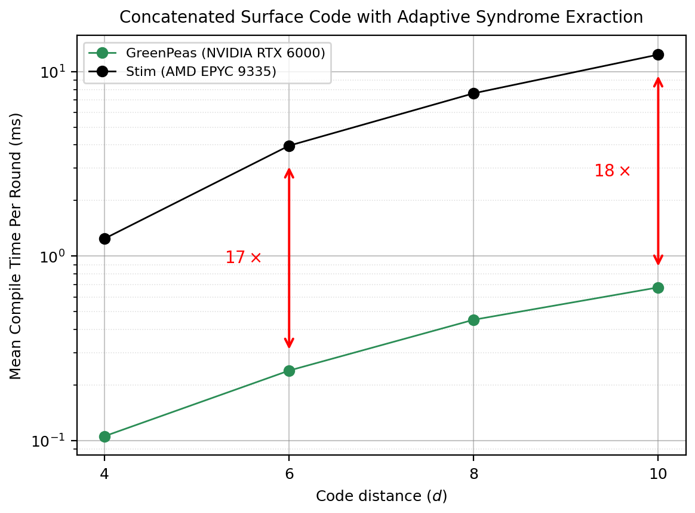

# GreenPeas

GPU-accelerated compilation of *detector error models (DEMs)* for adaptive quantum error correction.

GreenPeas builds DEMs just-in-time so decoders can track mid-circuit branching and time-varying noise.

It is orders of magnitude faster than standard CPU methods (see [paper](https://arxiv.org/abs/2604.16613)).

<p align="center">
  
</p>

## Quick start

1. Recommended: open the project in VS Code and accept the toast to reopen it in a container

2. Source the setup script with the compute capability `XX` of your GPU card, e.g., `86` for Ampere:

    ```sh
    source ./scripts/setup.sh XX
    ```

3. Create a Python virtual environment and install the `greenpeas` package with the optional dev dependencies:

    ```sh
    python3 -m venv venv
    source venv/bin/activate
    pip install .[dev]
    ```

4. Run the Python unit tests:

    ```sh
    pytest
    ```

## Basic Example

```python
"""Compile DEMs on the GPU."""

import greenpeas as gp

# Get the largest circuit.
circuit = gp.SurfaceCode(9).get_memory(rounds=9, p=0.001)

# Get a compiler driver for the largest circuit.
driver = gp.get_driver(circuit)

# Compile DEMs for various circuits within the bounds of the largest circuit.
for distance in (9, 7, 5, 3):
    circuit = gp.SurfaceCode(distance).get_memory(rounds=distance, p=0.001)
    dem = driver.compile_detector_error_model(circuit)
    print(f"distance {distance}: {dem.num_errors} errors")
```

## Citing GreenPeas

If you use GreenPeas in your research, please cite:

```bibtex
@misc{ziad2026greenpeas,
  title={GreenPeas: Unlocking Adaptive Quantum Error Correction with Just-in-Time Decoding Hypergraphs},
  author={Abbas B. Ziad and Jubo Xu and Hongxiang Fan},
  year={2026},
  eprint={2604.16613},
  archivePrefix={arXiv},
  primaryClass={quant-ph},
  url={https://arxiv.org/abs/2604.16613},
}
```

## Contact

For any questions or concerns, please [email me](mailto:abbasbrackenziad@gmail.com).

## License

Copyright 2026 Abbas Bracken Ziad

Licensed under the [Apache License 2.0](LICENSE).
